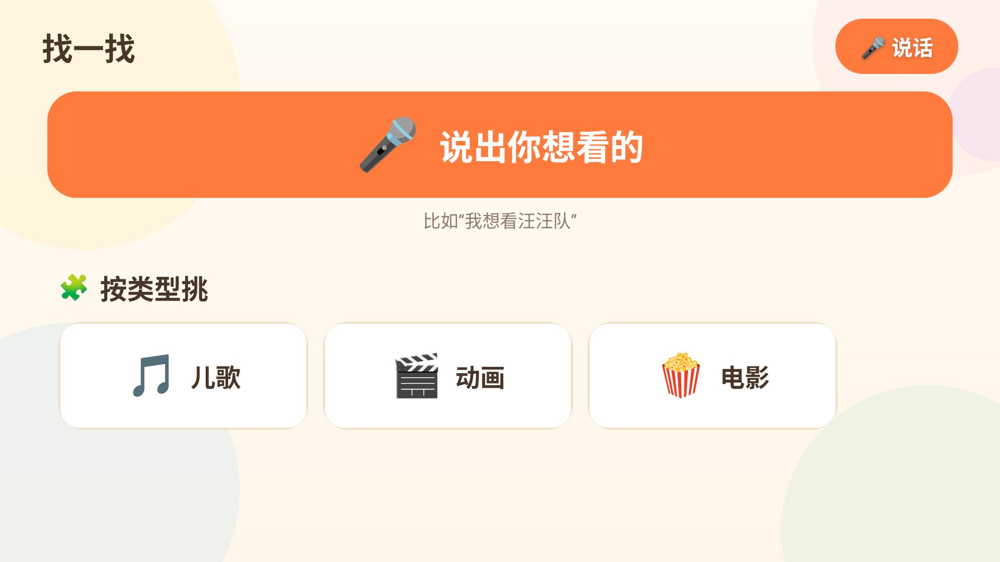
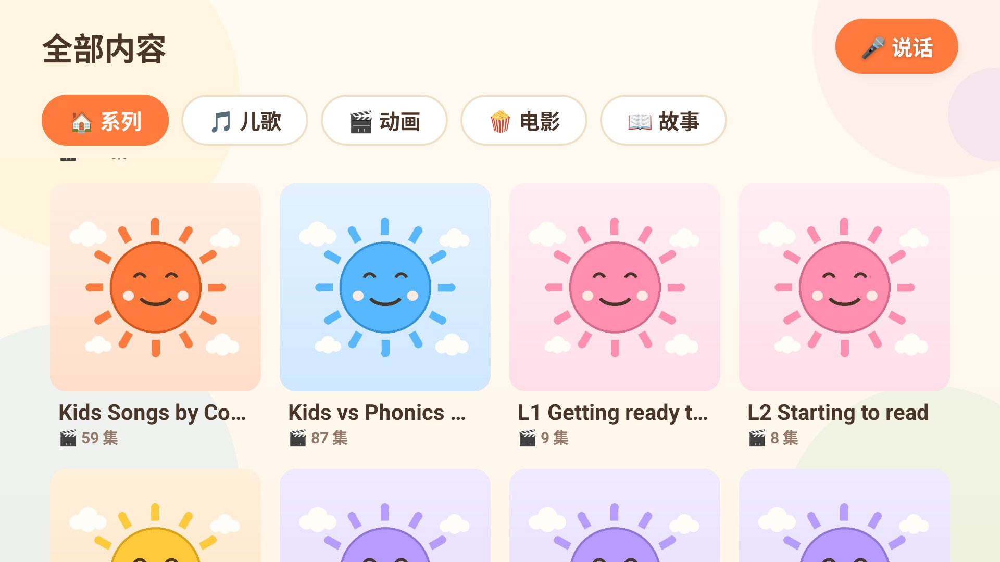
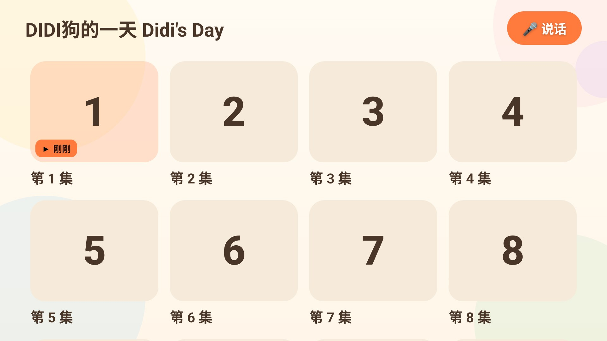
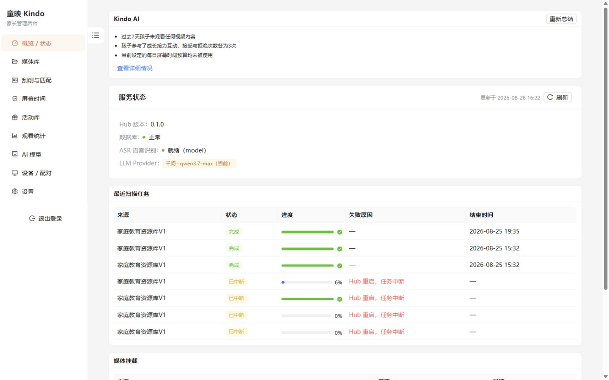
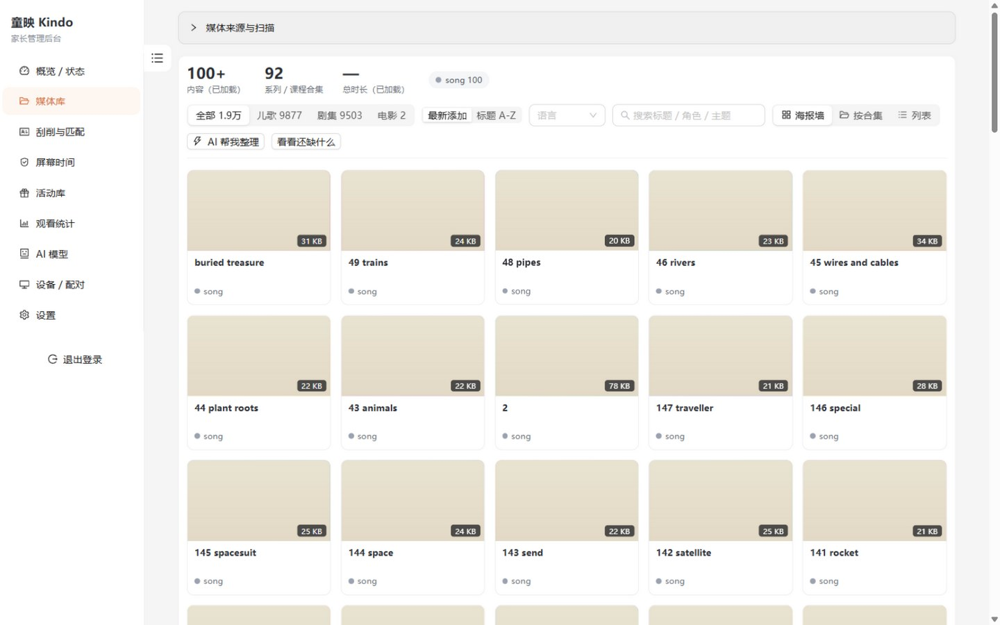
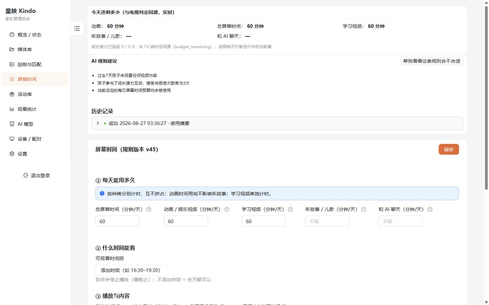

# 童映 Kindo

<p align="center">
  
</p>

**会聊天的家庭儿童媒体中心。**

孩子对着电视说一句「我想看汪汪队」，就能播放家里收藏的动画片、儿歌和故事；到了约定的观看时间，「成长接力」会温柔地接住孩子的兴趣；家长用浏览器管理内容、设定规则。

这是一个开源自托管项目：跑在你自己的设备上，内容来自你自己的硬盘——没有广告、没有推荐算法、不经过任何第三方内容平台，也不需要云账号。

[效果截图](#效果截图) · [快速开始](#快速开始) · [隐私与安全](#隐私与安全) · [参与开发](CONTRIBUTING.md) · [设计文档](docs/design/)

## 为什么做这个项目

- **家里攒了很多内容，孩子却用不了。** NAS、移动硬盘、网盘里躺着几十个系列的视频音频，但电视端的文件浏览器和输入法对 3~6 岁的孩子来说是天堑。
- **商业平台不可控。** 广告、自动播放、无穷的推荐流，家长不知道孩子下一个点开的是什么。
- **管屏幕时间伤感情。** 靠家长喊停，停的是动画，伤的是亲子关系。

Kindo 的答案：让孩子用最自然的方式（说话）使用家庭自己的内容库；让规则系统替家长当「坏人」，并且到点时不是生硬切断，而是尝试把兴趣引向故事、活动或对话。

## 它是怎么用的

**孩子（电视端，遥控器即可）**

- 按下语音键说「我想看汪汪队」——AI 在**你家的媒体库**里找，播之前会问清楚「第几集？」
- 不用键盘不用识字：界面是图标和大按钮，颜色明快、焦点醒目；「找一找」页可以按类型和主题挑选
- 看到约定时间，屏幕出现「成长接力」的选项：换个故事听、玩一个离屏小活动、或者聊聊刚才看的内容——孩子说不要就立刻结束，不会反复劝说

**家长（浏览器打开管理后台）**

- 添加媒体来源（本地目录 / SMB / WebDAV 网盘），自动扫描入库，TMDB 自动匹配系列海报与简介（你手动确认过的信息永远不会被覆盖）
- 设定屏幕时间：每天总时长、娱乐与学习视频分开计量、可看时段、听故事与 AI 聊天独立预算——所有播放入口（语音、遥控、自动连播、续播）都执行同一套规则
- 查看观看统计与兴趣洞察，管理设备配对和 AI 模型
- AI 助手可以帮你整理媒体库、总结观看情况、给出规则调整建议——**AI 只出主意，一切改动家长确认后才生效**

## 效果截图

### 电视端（学龄前视觉设计：亮色、大按钮、图标优先）

| 首页：一个麦克风入口 | 找一找：语音优先 |
|---|---|
|  |  |

| 浏览：系列海报墙 | 详情：大数字集卡 |
|---|---|
|  |  |

### 家长后台（浏览器）

| 概览与 AI 摘要 | 媒体库 |
|---|---|
|  |  |

| 屏幕时间规则 | |
|---|---|
|  | |

## 特性亮点

- 🎙 **语音优先**：为学龄前儿童设计，说话就能点播；语音识别在家庭网络内完成，可配角色名热词提升识别率
- 🗣 **家长声音（可选）**：家长朗读约 10 秒，AI 回复即以家长的声音播报，宝宝听着更熟悉；样本只存本机、随时删除，克隆服务不可用时自动回退系统语音
- 📺 **直连播放**：直接播放 NAS 原片（MP4/MKV/WebM/MOV，H.264/H.265，常见音频格式），不转码、不降画质、不占服务器 CPU；设备不支持时明确提示，而不是卡顿
- 🧠 **媒体库自动化**：目录扫描、文件名剧集结构识别、TMDB 身份匹配与海报简介；家长确认的信息优先级最高，永不被自动刮削覆盖
- 🛡 **规则是底线**：屏幕时间预算（总时长/娱乐/学习/音频/AI 语音五本账）+ 时段硬截止，由服务端统一执行；AI 没有绕过规则的权限
- 🌱 **成长接力**：观看达限时自动触发，提供听故事/离屏活动/聊天等承接选项；拒绝即止、单日有次数上限、有时间盒——不把「劝学」做成负担
- 🔒 **隐私内建**：孩子的语音只在家庭网络内处理、转写完成即释放；云端大模型只收到完成任务所需的最少文本（绝不包含音频、文件、路径、密钥）
- 🏠 **单家庭设计**：一台 Hub、一个孩子档案、无多租户——简单、可靠、好维护

## 快速开始

### 你需要准备

| 需要 | 说明 |
|---|---|
| 一台常开设备 | x86 或 ARM 的 NAS / 小主机 / 迷你服务器（跑 Docker；内存 2G+ 即可） |
| 家庭媒体内容 | 本地目录、SMB 共享或 WebDAV 网盘中的视频/音频文件 |
| 大模型接口 | 任一 OpenAI 兼容接口（对话理解用；服务商与模型由你选择） |
| Android TV | 电视或盒子（Android 5.0+，arm/arm64；遥控器最好带麦克风键） |

### 三步部署

```bash
# 1. 克隆并准备配置
git clone https://github.com/Aaron-LiLei/kindo.git && cd kindo/deploy
mkdir -p data/hub config media
cp kindo.example.yaml config/kindo.yaml        # 一般无需修改

# 2. 注入大模型接口（Secret 走环境变量，不落配置文件）
export KINDO_LLM_BASE_URL=https://你的OpenAI兼容端点/v1
export KINDO_LLM_API_KEY=sk-xxxx
export KINDO_LLM_MODEL=你的模型名

# 3. 启动
docker compose up -d --build
```

启动后：

1. 浏览器打开 `http://<设备IP>:8090/admin`，首次设置的管理员令牌在 `deploy/data/hub/bootstrap/` 目录中（或提前用 `KINDO_ADMIN_BOOTSTRAP_TOKEN` 环境变量指定）
2. 在「媒体库」添加来源并扫描；在「刮削与匹配」录入 TMDB Key 运行匹配管线
3. 电视安装 TV 端 APK → 输入 Hub 地址 → 输入 6 位配对码 → 在后台「设备/配对」批准

> 语音识别模型首次部署需下载（约 230MB，详见下方「语音识别模型」）。Kindo 是局域网产品，请勿直接暴露到公网；需要远程管理时走 VPN 或 HTTPS 反向代理（见 [SECURITY.md](SECURITY.md)）。

### 语音识别模型

默认使用 sherpa-onnx Paraformer 中文模型（离线、本地推理）。构建 ASR 镜像前下载：

```bash
cd apps/kindo-asr && mkdir -p model && cd model
curl -L -O https://github.com/k2-fsa/sherpa-onnx/releases/download/asr-models/sherpa-onnx-paraformer-zh-int8-2025-10-07.tar.bz2
tar -xjf sherpa-onnx-paraformer-zh-int8-2025-10-07.tar.bz2 --strip-components=1
```

模型缺失时 ASR 服务以「未配置」降级启动，电视端会如实提示语音不可用，其余功能不受影响。

## 隐私与安全

这条边界写进了架构，不是可选项：

- **孩子的原始语音不出家门**：电视 → Hub → 本地 ASR 容器，全程家庭网络；仅内存缓冲，转写完成即释放，默认不落盘、不写日志。
- **大模型只拿到最少文本**：远程 LLM 收到的是检索意图与必要上下文的文字，不包含音频、视频文件、NAS 路径、观看历史全文、任何密钥凭据。
- **密钥加密存储**：大模型 API Key、网盘/共享凭据在 Hub 数据库中加密落盘，接口永不回显；电视端不持有任何密钥。
- **字幕与外部元数据视为不可信内容**：其中出现的文字不构成指令，不能触发工具或绕过规则。

详见 [SECURITY.md](SECURITY.md)。

## 媒体格式（直连播放，不转码）

| 类别 | 支持 |
|---|---|
| 容器 | MP4 / MKV / WebM / MOV |
| 视频编码 | H.264、H.265/HEVC；AV1 视设备而定 |
| 音频编码 | AAC、Opus、MP3、FLAC；AC-3/EAC-3 视设备而定 |
| 纯音频内容 | MP3 / M4A / FLAC / WAV（儿歌、故事独立播放页） |

设备解码不支持时，电视端会用孩子听得懂的话说明，而不是转码或卡顿。

## 项目结构

| 目录 | 内容 |
|---|---|
| `apps/kindo-hub` | 服务端（Python + FastAPI + SQLite，含家长后台页面） |
| `apps/kindo-tv` | Android TV 客户端（Kotlin + Jetpack Compose for TV + Media3） |
| `apps/kindo-pad` | Android 平板客户端（Kotlin + Jetpack Compose + Media3，触屏·自适应 7"~12"） |
| `apps/kindo-asr` | 本地语音识别服务（sherpa-onnx Paraformer） |
| `apps/kindo-admin` | 家长后台前端源码（React + TypeScript + Ant Design） |
| `deploy` | Docker Compose 部署（amd64/arm64）与配置样例 |
| `docs` | 截图与设计文档 |

## 设计文档

完整的产品需求、交互设计、系统架构与技术方案见 [docs/design/](docs/design/)（中文）。

## 参与开发

环境搭建、质量门禁与提交约定见 [CONTRIBUTING.md](CONTRIBUTING.md)。

## 许可证

[MIT](LICENSE)。这是一个家庭项目导向的开源软件：欢迎自用、修改与分享，请以对孩子负责的方式使用它。
